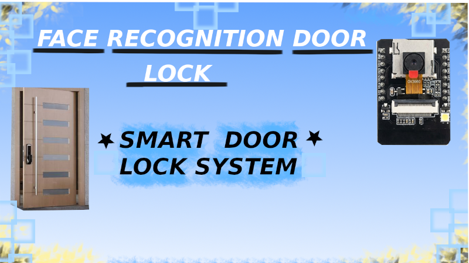
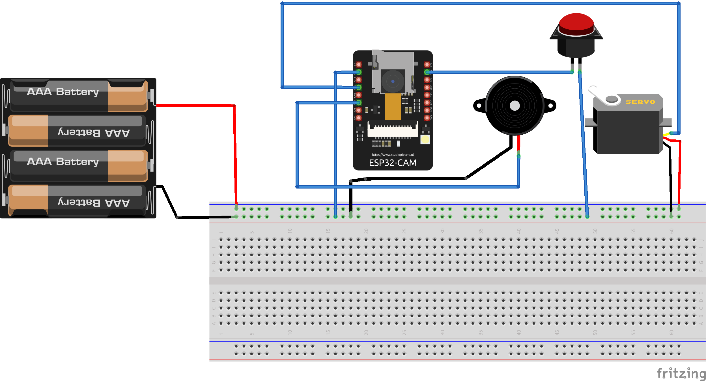

# Face Recognition Door Lock

## Project Thumbnail

## Features
- Face recognition
- Automatic door unlock
- Unknown face buzzer alert
- ESP32-CAM live camera
- Wi-Fi communication
- FaceLock web interface

## Hardware
- AI Thinker ESP32-CAM
- SG90 Servo Motor
- ESP32-CAM USB Programmer / FTDI Programmer
- Active Buzzer
- Push Button
- Jumper Wires
- 5V Power Supply

## Software
- Arduino IDE
- Python
- Flask
- OpenCV
- ESP32Servo Library

## How it Works
1. ESP32-CAM connects to Wi-Fi.
2. Camera captures faces.
3. FaceLock website registers users.
4. Python/OpenCV recognizes faces.
5. If authorized → Servo unlocks.
6. If unknown → Buzzer sounds.
7. Door locks again after 5 seconds.

## Project Structure
FaceLock_ESP32CAM.ino
CameraWebServer.ino
app.py
collect_faces.py
train_face.py
face_recognition.py
requirements.txt
templates/
user_faces/

## Wiring Diagram

## Bill of Materials

| Component | Quantity |
|-----------|---------:|
| AI-Thinker ESP32-CAM | 1 |
| SG90 Servo Motor | 1 |
| Active Buzzer | 1 |
| Jumper Wires | 1 Set |
| 5V Power Supply | 1 |
| ESP32-CAM USB Programmer | 1 |

The complete Bill of Materials :
- [FaceLock_BOM.csv](FaceLock_BOM.csv)

## Website
https://facelock-pgd8.onrender.com

## Future Improvements
- Multiple users
- Mobile app
- Cloud database
- Event logs
- Email/Telegram alerts

## License
MIT License
